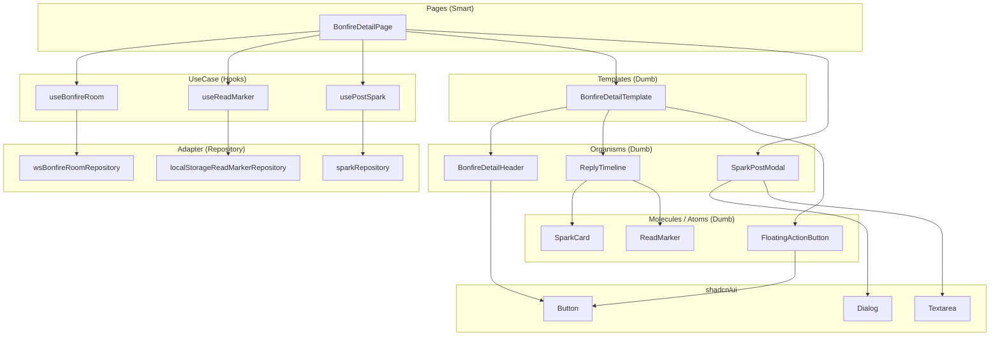

# 実装計画 - Bonfire 詳細ビュー (Frontend Refactoring)

本計画は、モックとして実装されている [BonfireDetailOverlay.tsx](file:///wsl.localhost/Ubuntu/home/syuma/ws/kvell/apps/web/src/components/pages/BonfireDetailOverlay.tsx) をリファクタリングし、既存の共通コンポーネントを活用した本番実装に移行するための手順を定義します。

**参照したプロンプト:**
- `.prompts/01_ubiquitous.md` (Ubiquitous Language)
- `.prompts/20_frontend.md` (Clean Architecture + Atomic Design)
- `.prompts/21_design_tokens.md` (Glassmorphism, Glow表現)

---

## バックエンド実装確認結果

> [!NOTE]
> **確認済み実装:**
> - **Reply投稿**: `POST /api/sparks` に `parent_bonfire_id` を渡す形式で実装済み ([post_spark/interactor.py](file:///wsl.localhost/Ubuntu/home/syuma/ws/kvell/apps/api/src/app/usecase/post_spark/interactor.py))
> - **WebSocket**: `/api/bonfires/{bonfire_id}/ws` 実装済み ([bonfire_router.py](file:///wsl.localhost/Ubuntu/home/syuma/ws/kvell/apps/api/src/app/adapter/entrypoints/bonfire_router.py))
> - **イベント型**: `SparkOutput` (レス) と `BonfireEvent` (`decayed`, `extended`) をUnion型でストリーム

---

## 変更内容

### 1. Domain Layer (`src/domain/`)

B/Eの `SparkOutput` および `BonfireEvent` と整合性を取ります。

| 操作 | ファイル | 内容 |
|------|----------|------|
| [MODIFY] | [spark.ts](file:///wsl.localhost/Ubuntu/home/syuma/ws/kvell/apps/web/src/domain/model/spark.ts) | `parentBonfireId?: string` を追加（B/E `SparkOutput` と対応） |
| [NEW] | [bonfireEvent.ts](file:///wsl.localhost/Ubuntu/home/syuma/ws/kvell/apps/web/src/domain/model/bonfireEvent.ts) | `BonfireEvent` 型定義（`event_type: 'decayed' | 'extended'`, `bonfire_id`, `message`） |
| [NEW] | [bonfireRoomRepository.ts](file:///wsl.localhost/Ubuntu/home/syuma/ws/kvell/apps/web/src/domain/repository/bonfireRoomRepository.ts) | `IBonfireRoomRepository` インターフェース（WebSocket接続） |
| [NEW] | [readMarkerRepository.ts](file:///wsl.localhost/Ubuntu/home/syuma/ws/kvell/apps/web/src/domain/repository/readMarkerRepository.ts) | `IReadMarkerRepository` インターフェース（LocalStorage操作） |

---

### 2. Adapter Layer (`src/adapter/repository/`)

| 操作 | ファイル | 内容 |
|------|----------|------|
| [NEW] | [wsBonfireRoomRepository.ts](file:///wsl.localhost/Ubuntu/home/syuma/ws/kvell/apps/web/src/adapter/repository/wsBonfireRoomRepository.ts) | `/api/bonfires/{id}/ws` への接続。`type: 'spark'` と `type: 'decayed' | 'extended'` を識別してコールバック |
| [NEW] | [localStorageReadMarkerRepository.ts](file:///wsl.localhost/Ubuntu/home/syuma/ws/kvell/apps/web/src/adapter/repository/localStorageReadMarkerRepository.ts) | `saveLastRead(bonfireId, sparkId)` / `getLastRead(bonfireId)` |
| [MODIFY] | [sparkRepository.ts](file:///wsl.localhost/Ubuntu/home/syuma/ws/kvell/apps/web/src/adapter/repository/sparkRepository.ts) | `postReply(content, parentBonfireId)` メソッド追加（既存の `postSpark` を拡張） |

---

### 3. UseCase Layer (`src/usecase/`)

| 操作 | ファイル | 内容 |
|------|----------|------|
| [NEW] | [useBonfireRoom.ts](file:///wsl.localhost/Ubuntu/home/syuma/ws/kvell/apps/web/src/usecase/useBonfireRoom.ts) | WebSocket接続管理、sparks配列の状態管理、`onDecayed` / `onExtended` コールバック |
| [NEW] | [useReadMarker.ts](file:///wsl.localhost/Ubuntu/home/syuma/ws/kvell/apps/web/src/usecase/useReadMarker.ts) | 既読位置の読み込み・保存 |
| [MODIFY] | [usePostSpark.ts](file:///wsl.localhost/Ubuntu/home/syuma/ws/kvell/apps/web/src/usecase/usePostSpark.ts) | `parentBonfireId` オプション引数を追加（リプライ対応） |

---

### 4. UI Layer - shadcn/ui コンポーネント使用計画

| コンポーネント | 用途 | ファイル |
|----------------|------|----------|
| `Dialog` / `DialogContent` / `DialogOverlay` | レス投稿モーダル（既存 `SparkPostModal` が使用中） | [dialog.tsx](file:///wsl.localhost/Ubuntu/home/syuma/ws/kvell/apps/web/src/components/ui/dialog.tsx) |
| `Button` | FAB、シェアボタン、薪くべボタン | [button.tsx](file:///wsl.localhost/Ubuntu/home/syuma/ws/kvell/apps/web/src/components/ui/button.tsx) |
| `Textarea` | レス投稿の入力欄（`SparkInput` が使用中） | [textarea.tsx](file:///wsl.localhost/Ubuntu/home/syuma/ws/kvell/apps/web/src/components/ui/textarea.tsx) |
| `Card` | 必要に応じてレスカードのベースとして検討 | [card.tsx](file:///wsl.localhost/Ubuntu/home/syuma/ws/kvell/apps/web/src/components/ui/card.tsx) |

---

### 5. UI Layer - Atoms / Molecules (`src/components/`)

| 操作 | ファイル | 内容 |
|------|----------|------|
| [MODIFY] | [SparkCard.tsx](file:///wsl.localhost/Ubuntu/home/syuma/ws/kvell/apps/web/src/components/molecules/SparkCard.tsx) | `hideFuelButton?: boolean` Props追加。Bonfire内レスでは薪くべボタンを非表示に |
| [REUSE] | [FloatingActionButton.tsx](file:///wsl.localhost/Ubuntu/home/syuma/ws/kvell/apps/web/src/components/atoms/FloatingActionButton.tsx) | そのまま流用 |
| [MODIFY] | [SparkPostModal.tsx](file:///wsl.localhost/Ubuntu/home/syuma/ws/kvell/apps/web/src/components/organisms/SparkPostModal.tsx) | ラベル変更Props追加（`submitLabel?: string`）でレス投稿時は「レスを投げる」等に変更可能に |
| [NEW] | [ReadMarker.tsx](file:///wsl.localhost/Ubuntu/home/syuma/ws/kvell/apps/web/src/components/atoms/ReadMarker.tsx) | 「ここまで読んだ」ボーダー。現在のベタ書きを切り出し |

---

### 6. UI Layer - Organisms (`src/components/organisms/`)

| 操作 | ファイル | 内容 |
|------|----------|------|
| [NEW] | [BonfireDetailHeader.tsx](file:///wsl.localhost/Ubuntu/home/syuma/ws/kvell/apps/web/src/components/organisms/BonfireDetailHeader.tsx) | **Dumb**。Hero画像、親Spark内容、勢い表示、薪くべ/シェアボタン。`isDecayed` で無効化制御 |
| [NEW] | [ReplyTimeline.tsx](file:///wsl.localhost/Ubuntu/home/syuma/ws/kvell/apps/web/src/components/organisms/ReplyTimeline.tsx) | **Dumb**。`react-virtuoso` + `SparkCard` + `ReadMarker`。スマートスクロール対応 |

---

### 7. UI Layer - Templates (`src/components/templates/`)

| 操作 | ファイル | 内容 |
|------|----------|------|
| [NEW] | [BonfireDetailTemplate.tsx](file:///wsl.localhost/Ubuntu/home/syuma/ws/kvell/apps/web/src/components/templates/BonfireDetailTemplate.tsx) | **Dumb**。Bonfire詳細のレイアウト骨組み。`headerSlot`, `timelineSlot`, `fabSlot` を受け取り配置 |

---

### 8. UI Layer - Pages (`src/components/pages/`)

| 操作 | ファイル | 内容 |
|------|----------|------|
| [RENAME+REFACTOR] | [BonfireDetailPage.tsx](file:///wsl.localhost/Ubuntu/home/syuma/ws/kvell/apps/web/src/components/pages/BonfireDetailPage.tsx) | **Smart**。既存の `BonfireDetailOverlay.tsx` をリネーム。`useBonfireRoom`, `useReadMarker`, `usePostSpark` を統合。`BonfireDetailTemplate` にOrganismsを流し込む。モックデータ削除 |

---

## レイヤー責務の整理

---

## 実装順序

1.  **Domain & Adapter (リポジトリ)**
    - `spark.ts` に `parentBonfireId` 追加
    - `bonfireEvent.ts` 新規作成
    - `IReadMarkerRepository` と `localStorageReadMarkerRepository`
    - `IBonfireRoomRepository` と `wsBonfireRoomRepository`
    - `sparkRepository` に `postReply` 追加

2.  **UseCase (Hooks)**
    - `useReadMarker`
    - `useBonfireRoom`
    - `usePostSpark` の `parentBonfireId` 対応

3.  **UI - Atoms/Molecules**
    - `ReadMarker` コンポーネント切り出し
    - `SparkCard` に `hideFuelButton` 追加
    - `SparkPostModal` に `submitLabel` 追加

4.  **UI - Organisms**
    - `BonfireDetailHeader`
    - `ReplyTimeline`

5.  **UI - Templates**
    - `BonfireDetailTemplate`

6.  **UI - Pages (Refactor)**
    - `BonfireDetailOverlay.tsx` → `BonfireDetailPage.tsx` にリネーム・本実装化

---

## 検証計画

### 自動テスト

- **UseCase Unit Tests**: `useBonfireRoom` がWebSocket接続を正しくハンドルするか、`useReadMarker` がLocalStorageを正しく読み書きするかをモックで検証。
- **E2E Tests**: `05_bonfire_detail.feature` に基づくシナリオテスト。

### 手動検証

- **リアルタイム更新 (Spark)**: 別タブでレス投稿 → 詳細画面に即時反映
- **イベント受信 (Decayed/Extended)**: Bonfireが鎮火(Decay)した際にFAB/シェアボタンが無効化
- **既読マーカー**: ページリロード後、前回位置まで自動スクロール
